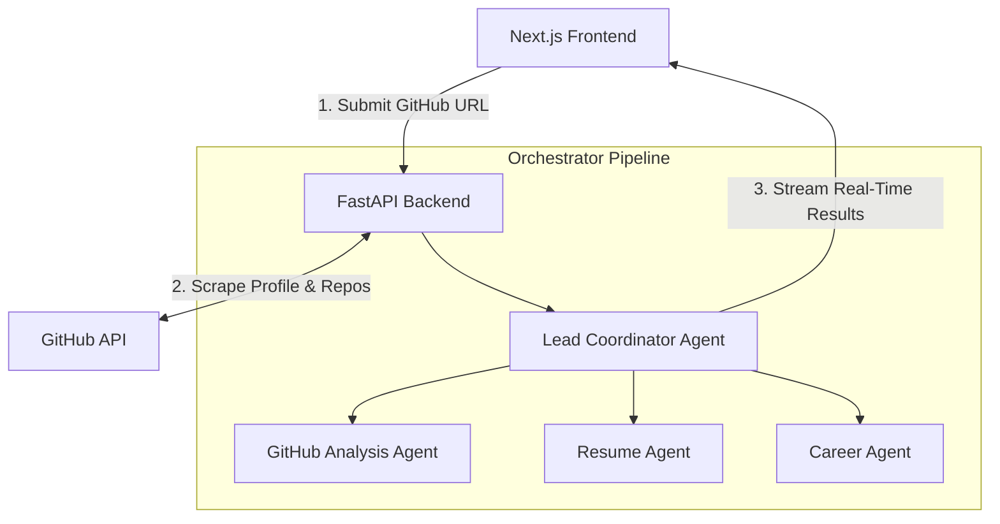

# Agentic GitHub Profile Reviewer

**🔗 Live Demo:** [https://agentic-github-profile-reviewer.onrender.com/](https://agentic-github-profile-reviewer.onrender.com/)

A modern, multi-agent AI system built using **Google ADK (Agent Development Kit)** and **Google Gemini** that reviews developer GitHub portfolios, highlights technical strengths, generates ATS-friendly STAR resume bullets, maps personalized skill roadmaps, and analyzes developer career role fits.

---

## 🏗️ Architecture & Orchestration Flow

The application uses an orchestration model where a **Lead Coordinator Agent** manages and synthesizes findings from specialized sub-agents. 

### Multi-Agent Pipeline



---

## 🛠️ Tech Stack

* **Frontend:** Next.js (TypeScript, Tailwind CSS, Lucide Icons)
* **Backend:** FastAPI (Python, Uvicorn, Server-Sent Events)
* **AI Orchestration:** Google ADK (Agent Development Kit) & Google GenAI SDK
* **LLM Engine:** Gemini 2.5 Flash (`gemini-2.5-flash`)

---

## 🚀 Getting Started

Follow these steps to set up and run the application locally.

### Prerequisites
* **Python** 3.10+
* **Node.js** 18+ (with `npm`)
* **Google Gemini API Key** (Get one from [Google AI Studio](https://aistudio.google.com/))

---

### 1. Backend Installation & Setup

1. **Navigate to the root directory** and create a Python virtual environment:
   ```bash
   python -m venv .venv
   ```

2. **Activate the virtual environment**:
   * **Windows (PowerShell):**
     ```powershell
     .\.venv\Scripts\Activate.ps1
     ```
   * **macOS/Linux:**
     ```bash
     source .venv/bin/activate
     ```

3. **Install the dependencies**:
   ```bash
   pip install -r backend/requirements.txt
   ```

4. **Configure environment variables**:
   Create a `.env` file inside the `backend/` directory (`backend/.env`) with the following variables:
   ```env
   # Required: Gemini API Key
   GEMINI_API_KEY="YOUR_GEMINI_API_KEY"

   # Optional: GitHub token to increase rate limit thresholds
   GITHUB_TOKEN="YOUR_GITHUB_PERSONAL_ACCESS_TOKEN"

   # Server Settings
   PORT=8000
   HOST=127.0.0.1
   ```

5. **Start the FastAPI backend server**:
   Make sure you are running this command in the context of the `backend` folder:
   ```bash
   # From root directory:
   cd backend
   ..\.venv\Scripts\python.exe -m uvicorn app.main:app --host 127.0.0.1 --port 8000 --reload
   ```

---

### 2. Frontend Installation & Setup

1. **Navigate to the frontend directory**:
   ```bash
   # From the root directory:
   cd frontend
   ```

2. **Install Node dependencies**:
   ```bash
   npm install
   ```

3. **Start the Next.js development server**:
   ```bash
   npm run dev
   ```

4. **Access the application**:
   Open [http://localhost:3000](http://localhost:3000) in your web browser.

---

## 🛡️ Handling Rate Limits & Quotas (429 Errors)

If you use the **Google AI Studio Free Tier**, you may occasionally hit rate limits (`429 Resource Exhausted`) due to the multiple back-to-back agent queries.

### Mitigations:
1. **Mock Mode (Developer Testing):**
   If you want to test the frontend and backend orchestration interface without exhausting your API quota, change the API key in `backend/.env` to:
   ```env
   GEMINI_API_KEY="mock-key"
   ```
   The backend will detect this key and automatically switch to serving high-fidelity, simulated profile review streams.
2. **Wait and Retry:** 
   Free tier limits typically reset every 60 seconds.
3. **Switch to Paid Tier:**
   Set up billing on Google AI Studio to increase your rate limits and daily quotas.

